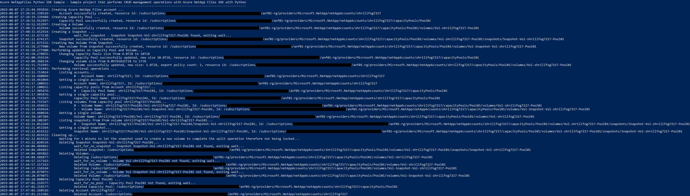

# Azure NetAppFiles SDK Sample for Python

This project demonstrates how to perform management CRUD operations for Microsoft.NetApp resource provider using Python.

In this sample application we perform the following operations:

* Creation
  * NetApp Files Account
  * Capacity Pool
  * Volume
  * Snapshot
  * Volume from Snapshot
* Updates
  * Change a Capacity Pool size from 4TiB to 10TiB
  * Change a Volume size from 100GiB to 1TiB
  * Add a new NFS export policy to an existing volume
* Deletions
  * Snapshot
  * Volumes
  * Capacity Pools
  * Accounts

If you don't already have a Microsoft Azure subscription, you can get a FREE trial account [here](http://go.microsoft.com/fwlink/?LinkId=330212).

## Prerequisites

1. Python (code was built and tested under 3.7.3 version)
3. Azure Subscription
4. Subscription needs to be whitelisted for Azure NetApp Files. For more information, please refer to [this](https://docs.microsoft.com/azure/azure-netapp-files/azure-netapp-files-register#waitlist) document.
5. Resource Group created
6. Virtual Network with a delegated subnet to Microsoft.Netapp/volumes resource. For more information, please refer to [Guidelines for Azure NetApp Files network planning](https://docs.microsoft.com/en-us/azure/azure-netapp-files/azure-netapp-files-network-topologies)
7. For this sample Python console application work, we need to authenticate and the method choosen for this sample is using service principals.
   1. Within an [Azure Cloud Shell](https://docs.microsoft.com/en-us/azure/cloud-shell/quickstart) session, make sure you're logged on at the subscription where you want to be associated with the service principal by default:
            ```bash
            az account show
           ```
             If this is not the correct subscription, use             
             ```bash
            az account set -s <subscription name or id>  
            ```
        1. Create a service principal using Azure CLI
            ```bash
            az ad sp create-for-rbac --sdk-auth
            ```

            >Note: this command will automatically assign RBAC contributor role to the service principal at subscription level, you can narrow down the scope to the specific resource group where your tests will create the resources.

        2. Copy the output content and paste it in a file called azureauth.json and secure it with file system permissions
        3. Set an environment variable pointing to the file path you just created, here is an example with Powershell and bash:
            Powershell 
            ```powershell
           [Environment]::SetEnvironmentVariable("AZURE_AUTH_LOCATION", "C:\sdksample\azureauth.json", "User")
            ```
            Bash
            ```bash
           export AZURE_AUTH_LOCATION=/sdksamples/azureauth.json
           ``` 

        >Note: for other Azure Active Directory authentication methods for Python, please refer to these [samples](https://github.com/AzureAD/microsoft-authentication-library-for-python/tree/dev/sample). 

## What is example.py doing? 

Currently, Azure NetApp Files SDK exposes control plane management operations, CRUD operations for its resources like accounts, capacity pools, volumes and snapshots. We start this execution by defining some basic variables that will be used throughout the code to define resrouce group name, location, account name, etc.

>Note: Please refer to [Resource limits for Azure NetApp Files](https://docs.microsoft.com/en-us/azure/azure-netapp-files/azure-netapp-files-resource-limits) to understand ANF's most current limits.

Next, it will move forward to the authentication process, this sample uses `ServiceClientCredentials` (service principal based authentication) which is accepted by `AzureNetAppFilesManagementClient` to create the management client, that is extensively used throughout the code.

Then, it will start the CRUD operations by creating one account, then capacity pool, volume, snapshot and volume from snapshot, in this exact sequence \(for more information about Azure NetApp Files storage hierarchy please refer to [this](https://docs.microsoft.com/en-us/azure/azure-netapp-files/azure-netapp-files-understand-storage-hierarchy) document\). After all resources are created, it will perform an update to a capacity pool by increasing its size; it will perform updates to a volume by changing its usage threshold (size) and adding an extra export policy.

Finally, the clean up process takes place (not enabled by default, please change variable `SHOULD_CLEANUP` to `True` if you want clean up to take place), deleting all resources in the reverse order following the hierarchy otherwise we can't remove resources that have nested resources still live. You will also notice that the clean up process uses a function called `wait_for_anf_resource`, at this moment this is required so we can workaround a current ARM behavior of reporting that the object was deleted when in fact its deletion is still in progress. We will also notice some functions called get_anf_`<resource type>`, these were also created in this sample to be able to get the name of the resource without its hierarchy represented in the `<resource type>.name` property, which cannot be used directly in other methods of Azure NetApp Files client like `get`.

## Contents

| File/folder                 | Description                                                                                                      |
|-----------------------------|------------------------------------------------------------------------------------------------------------------|
| `media\`                       | Folder that contains screenshots.                                                                                              |
| `src\`                       | Sample source code folder.                                                                                              |
| `src\example.py`            | Sample main file.                                                                                                |
| `src\sample_utils.py`       | Sample file that contains authentication functions, all wait functions and other small functions.                |
| `src\resource_uri_utils.py` | Sample file that contains functions to work with URIs, e.g. get resource name from URI (`get_anf_capacity_pool`). |
| `src\requirements.txt`       | Sample script required modules.                                                                                  |
| `.gitignore`                | Define what to ignore at commit time.                                                                            |
| `CHANGELOG.md`              | List of changes to the sample.                                                                                   |
| `CONTRIBUTING.md`           | Guidelines for contributing to the sample.                                                                       |
| `README.md`                 | This README file.                                                                                                |
| `LICENSE`                   | The license for the sample.                                                                                      |
| `CODE_OF_CONDUCT.md`        | Microsoft's Open Source Code of Conduct.                                                                         |

## How to run the script

1. Clone it locally
    ```powershell
    git clone https://github.com/Azure-Samples/netappfiles-python-sdk-sample
    ```
1. Change folder to **.\netappfiles-python-sdk-sample\src**
2. Install any missing dependencies as needed
    ```bash
    pip install -r ./requirements.txt
    ```
3. Make sure you have the azureauth.json and its environment variable with the path to it defined (as previously describe in [prerequisites](#Prerequisites))
4. Edit file **example.py** and change the variables contents as appropriate (names are self-explanatory).
5. Run the script
    ```powershell
    python ./example.py
    ```

Sample output


## References

* [Azure Active Directory Python Authentication samples](https://github.com/AzureAD/microsoft-authentication-library-for-python/tree/dev/sample)
* [Resource limits for Azure NetApp Files](https://docs.microsoft.com/en-us/azure/azure-netapp-files/azure-netapp-files-resource-limits)
* [Azure Cloud Shell](https://docs.microsoft.com/en-us/azure/cloud-shell/quickstart)
* [Azure NetApp Files documentation](https://docs.microsoft.com/en-us/azure/azure-netapp-files/)
* [Download Azure SDKs](https://azure.microsoft.com/downloads/) 
